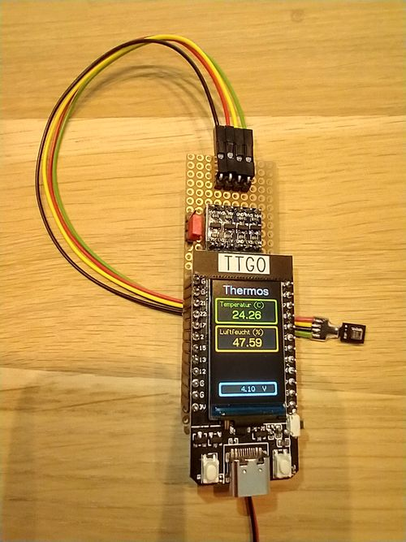

## TTGO-Thermos

Messgerät für Themperatur und Luftfeuchtigkeit auf Basis des ESP32 TTGO t-display und dem AHT25 Sensors

Hardware:
- TTGO t-display Board mit ESP32 (https://github.com/Xinyuan-LilyGO/TTGO-T-Display)
- Sensor AHT25 ()

